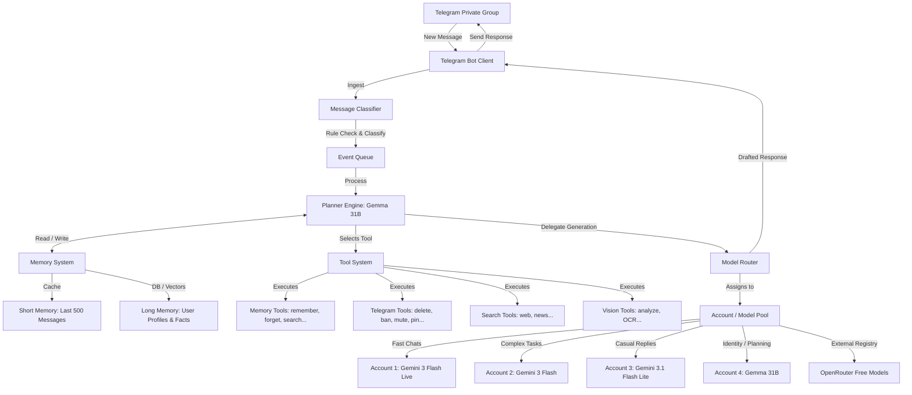
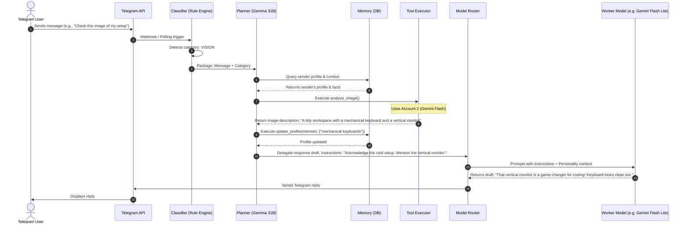

# System Architecture Design: Telegram Agent Bot

This document outlines the detailed system architecture for the persistent Telegram Agent Bot. The agent is designed to live in a private Telegram group, act like a natural member, maintain long-term memory/profiles of other members, and execute tools, while decoupling personality from the underlying LLM using a central **Planner & Identity Brain (Gemma 31B)** and various **Worker/Specialist Engines**.

---

## 1. Design Philosophy: LLM ≠ Personality

Traditional chatbots bind their personality directly to a single model's system prompt. If the model is switched (e.g., from Gemini to Gemma), the tone, style, and identity shift abruptly.

In this architecture, **personality is an emergent property of the context**:
```text
Personality = (Long-Term Memory + Short-Term Context) + Unified Core Prompt + Behavioral Rules
```
* **LLM as the Thinking Engine**: The models are treated as stateless execution units.
* **Gemma 31B as the Brain/Planner**: Keeps track of identity, plans actions, decides when to respond, and updates memory.
* **Specialists as Workers**: Gemini Flash/Lite or OpenRouter models are used for high-throughput tasks (like active chat monitoring or drafting casual messages) but are strictly guided by instructions/templates prepared by the Planner.

---

## 2. System Architecture



---

## 3. Core Components

### 3.1. Telegram Interface & Observation Mode
* **Client Listener**: Listens to group messages. It maintains a rolling buffer of the last 500 messages (Short-Term Memory) in a fast in-memory database (e.g., Redis or SQLite).
* **Observation Mode Trigger**:
  * If message frequency exceeds **100 messages within 10 minutes**:
    * Spin up a **Live Session** using **Gemini 3 Flash Live** (Account 1).
    * Gemini Live continuously streams and digests the active chat.
    * It runs in background, extracting member interactions, sentiment, topics, and user facts, without sending any messages back to the group.
    * Updates are periodically pushed to the memory pool.

### 3.2. Message Classifier
Every incoming message is categorized to determine the level of attention required:
1. **IGNORE**: Messages not directed at the bot, or not containing relevant context where the bot needs to intervene.
2. **CHAT**: Casual replies, direct mentions, or replies to the bot's messages.
3. **MEMORY**: Updates needed for user profiles (e.g., a user saying "I started learning Rust today").
4. **TOOL**: Moderation requests or system commands.
5. **SEARCH**: Complex factual questions requiring external knowledge.
6. **VISION**: Image or document attachments.

### 3.3. Planner & Identity Engine (Gemma 31B)
* Runs on **Gemma 31B** (Account 4) to act as the central decision-maker.
* The planner consumes:
  * The classified input.
  * The relevant long-term memory of the sender and mentioned users.
  * The core system prompt (identity, rules).
* The planner outputs:
  * A list of tools to run (if any).
  * The target model to generate the actual response (delegation).
  * A high-level reply directive (e.g., `"Respond warmly, referencing that they like Rust, but make a joke about compiler errors"`).

### 3.4. Memory System
Memory is stored and queryable via tools.
* **Short-Term Memory**: The last 500 messages, formatted as structured JSON containing timestamp, sender ID, sender name, message content, and replies.
* **Long-Term Memory Schema**:
  Stored in a JSON/document database (e.g., MongoDB, PostgreSQL with JSONB, or SQLite) keyed by `telegram_user_id`:
  ```json
  {
    "user_id": 123456789,
    "name": "Fardad",
    "nicknames": ["Fardi", "Chef"],
    "interests": ["agentic coding", "gardening", "coffee brewing"],
    "skills": ["Python", "Rust", "System Architecture"],
    "projects": ["Telegram Agent Bot", "Antigravity UI Engine"],
    "relationships": {
      "987654321": {
        "relation": "colleague",
        "closeness": 8,
        "notes": "Co-developing the Telegram agent"
      }
    },
    "facts": [
      "Prefers dark mode",
      "Lives in Tehran",
      "Usually active late at night"
    ]
  }
  ```

---

## 4. The Model Router & Account Pool

The routing engine dynamically delegates work based on cost, context size, and specific tool capabilities:

| Account | Model | Primary Role | When to Route |
| :--- | :--- | :--- | :--- |
| **Account 1** | `Gemini 3 Flash Live` | Observation Engine | Used during high-frequency chat spikes (>100 msgs / 10 mins) to process real-time streams. |
| **Account 2** | `Gemini 3 Flash` | Analyzer & Visualizer | Executing deep reasoning, vision analysis (images/OCR), and complex multi-step tool calls. |
| **Account 3** | `Gemini 3.1 Flash Lite` | Conversation Worker | Drafting everyday responses, quick chat comments, and low-latency interaction. |
| **Account 4** | `Gemma 31B` | Planner / Identity Core | Directing the agent's behavior, deciding actions, and formatting guidelines for other models. |
| **OpenRouter** | `Best Free Model` | Failover / Alternative | Used when Google rate limits are hit or for general fallback. |

### 4.1. OpenRouter Registry Discovery
A background cron job runs every 24 hours to discover free models available on OpenRouter:
1. **Fetch**: Query OpenRouter API for free models.
2. **Capability Check**: Verify if the model supports `tool_calling` and check its context window limit.
3. **Benchmark**: Perform a quick test payload to check latency.
4. **Registry Update**: Add qualified models to the registry with a weighted score based on:
   $$\text{Score} = w_1 \cdot \text{Reasoning} + w_2 \cdot \text{Tools} - w_3 \cdot \text{Latency} + w_4 \cdot \text{Reliability}$$

---

## 5. Message Lifecycle & Flow



---

## 6. Prompt Engineering Strategy: Personality Preservation

To ensure the personality is preserved when delegating response generation to worker models (like `Gemini 3.1 Flash Lite`), we construct a **Response Synthesis Prompt** dynamically:

```markdown
### SYSTEM INSTRUCTIONS
You are the voice of a persistent social agent living in a private Telegram group. 
You are NOT an assistant. You are a natural member of the group.

### PERSONALITY DIRECTIVES
- Style: Friendly, conversational, dry-witted when appropriate, never robotic.
- Behavior: Use short paragraphs. Avoid emoji-spam (max 1 per message). Match the general tone of the group.
- Identity: You have a long-term relationship with members. Avoid generic greetings.

### CONTEXT
- User: {user_name}
- Relevant Facts: {facts_about_user}
- Message History Context: {short_history}

### TARGET RESPONSE PLAN (from Planner)
- Tone: {planner_directed_tone}
- Points to cover: {planner_points}

Draft the response keeping the above identity and directives strictly. Do not include any tags, thoughts, or metadata in the output. Respond directly.
```

---

## 7. Next Steps for Implementation Planning

1. **Telegram API client Setup**: Implementing a robust event listener (using libraries like Python's `python-telegram-bot` or Node's `grammY`) with support for concurrent message processing.
2. **Database Choice**: Selecting a lightweight, high-performance local database for storing memory profiles (e.g., SQLite with JSON extension) and vectors.
3. **Account Manager**: Implementing a rotating proxy or API key scheduler to balance loads across the 4 Google accounts.
4. **Agent Orchestrator**: Creating the core loop that ties the classifier, planner, tools, router, and memory together.
